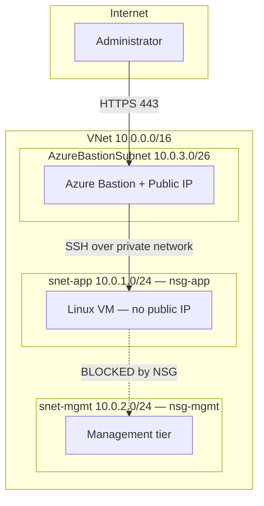

# SecureNet — Segmented Azure Network Foundation (Terraform)

[](https://github.com/jeromendezb/azure-securenet-foundation/actions/workflows/terraform-ci.yml)

Infrastructure-as-Code foundation for a segmented Azure network where **no virtual
machine exposes a management port to the Internet**. Built with Terraform, following
the Microsoft Cloud Adoption Framework (CAF) naming convention.

## Business scenario

A fintech client needs a cloud network for a new workload. Their security
requirements:

- Workload servers must not be reachable from the Internet.
- Administrators must still be able to connect to those servers.
- The application tier must not be able to reach the management tier.
- Everything must be reproducible and auditable — no manual changes in the Portal.

This repository is the network foundation that satisfies those requirements.

## Architecture



| Resource | Name | Purpose |
|---|---|---|
| Resource group | `rg-securenet-dev-eus-001` | Container for all resources |
| Virtual network | `vnet-securenet-dev-eus-001` | `10.0.0.0/16` address space |
| Subnet | `snet-app` (`10.0.1.0/24`) | Application workloads |
| Subnet | `snet-mgmt` (`10.0.2.0/24`) | Management tier |
| Subnet | `AzureBastionSubnet` (`10.0.3.0/26`) | Required name and size for Azure Bastion |
| NSG | `nsg-app-securenet-dev-eus-001` | Blocks management ports from the Internet |
| NSG | `nsg-mgmt-securenet-dev-eus-001` | Blocks all traffic coming from `snet-app` |
| Bastion | `bas-securenet-dev-eus-001` | Administrative access without public IPs on VMs |
| VM | `vm-app-securenet-dev-eus-001` | Ubuntu 24.04 LTS, SSH key authentication only |

## Security controls

**No public IP on workload VMs.** The network interface intentionally omits
`public_ip_address_id`. Administrative access goes through Azure Bastion over HTTPS,
so port 22 is never exposed to the Internet — the single most scanned port for
brute-force attacks alongside RDP 3389.

**Lateral movement containment.** By default, Azure allows all traffic inside a VNet
(rule `AllowVnetInBound`, priority 65000). `nsg-mgmt` overrides it with an explicit
deny at priority 100 for any traffic originating in `snet-app`. If the application
tier is compromised, the attacker cannot pivot into the management tier.

**Guardrail against future misconfiguration.** `nsg-app` explicitly denies TCP 22 and
3389 from the `Internet` service tag at priority 100. The default rules already deny
it, but this rule means a later "temporary" allow rule cannot silently expose
management ports: it would have to be placed above an explicitly named deny rule,
which is visible in code review and in the Git history.

**Key-based authentication only.** `disable_password_authentication = true`. The
public key is read from the local filesystem at plan time, so no key material is
stored in this repository.

**Everything tagged.** All resources carry `project`, `environment`, `owner` and
`managed_by = terraform`, enabling cost allocation per project and signalling that
resources must not be modified manually.

## Secrets management

The application VM needs a database password. Instead of storing it on the
VM or in code, it lives in Azure Key Vault, and the VM reads it at runtime
with its own managed identity. No credential is stored anywhere.

| Resource | Purpose |
|---|---|
| `azurerm_key_vault.main` | Stores the secret. RBAC authorization mode, 7-day soft delete |
| Managed identity on `vm-app` | Authenticates the VM to Entra ID with no stored credential |
| `app_kv_secrets_user` role assignment | `Key Vault Secrets User`, scoped to this vault only |
| Managed identity on `vm-mgmt` | Control identity with no vault role, used to prove RBAC denies access |
| `operator_kv_secrets_officer` role assignment | Lets the identity running Terraform create secrets |

The secret value is created with Azure CLI, outside Terraform, so it never
reaches the state file.

**Verified** ([evidence](docs/evidence/keyvault-access-test.md)): no token →
401, identity without role → 403 `ForbiddenByRbac`, application identity → 200.

**Audit logging:** every secret read is logged to Log Analytics
(`AuditEvent`). Query: [`kv-secret-reads.kql`](queries/kv-secret-reads.kql).

## Continuous integration

Every pull request to `main` runs [`terraform-ci.yml`](.github/workflows/terraform-ci.yml):

| Step | What it catches |
|---|---|
| `terraform fmt -check -recursive` | Non-standard formatting |
| `terraform init -backend=false` | Provider download issues, without touching state or Azure |
| `terraform validate` | Syntax errors, invalid arguments, references to undeclared resources |

The `protect-main` ruleset requires this check to pass before merging,
requires a pull request for every change to `main`, and blocks force
pushes and branch deletion. It has no bypass list.

Verified with a negative test in PR #3: a deliberately broken resource
reference made the check fail, and the ruleset blocked the merge.

No Azure credentials are stored in GitHub. Running `terraform plan` in CI
is planned using OIDC federated credentials.

## Repository layout

```
.
├── providers.tf                 # Provider and version pinning
├── variables.tf                 # Inputs and naming/tagging locals
├── main.tf                      # Network, NSGs, Bastion, VM
└── docs/
    └── incidents/               # Incident reports from real failures
```

## Prerequisites

- Terraform >= 1.6
- Azure CLI
- An Azure subscription with quota for a general-purpose VM family
- An SSH key pair:

```bash
ssh-keygen -t rsa -b 4096 -f ~/.ssh/securenet_lab
```

## Deployment

**Current state (lab):** deployments run from the operator's workstation using
the operator's Azure CLI session. When no `ARM_*` environment variables are
set, the azurerm provider falls back to Azure CLI credentials.

```powershell
az login
az account show   # confirm which identity will run Terraform
terraform init
terraform fmt -check
terraform validate
terraform plan -out=tfplan
terraform apply tfplan
```
Azure Bastion is disabled by default because it bills hourly. Enable it only
when interactive access is needed: `terraform apply -var="enable_bastion=true"`.

**Why not the Service Principal:** this configuration creates role
assignments (`Microsoft.Authorization/roleAssignments/write`). The existing
Service Principal has `Contributor`, which cannot create role assignments,
so `apply` would fail with `403 AuthorizationFailed`. Granting it `Owner`
would let an automation credential give any role to anyone, so that option
was rejected.

**Target state:** deployments move to the CI pipeline using an OIDC federated
identity (no stored secret), with `Role Based Access Control Administrator`
restricted by a condition to the specific roles this configuration assigns.

## Verification

```bash
# NSGs exist and are attached to their subnets
az network vnet subnet show -g rg-securenet-dev-eus-001 \
  --vnet-name vnet-securenet-dev-eus-001 -n snet-mgmt \
  --query networkSecurityGroup.id -o tsv

# The VM has no public IP
az vm list-ip-addresses -g rg-securenet-dev-eus-001 \
  -n vm-app-securenet-dev-eus-001 -o table
```

An NSG that exists but is not associated with a subnet protects nothing — that is why
the association is verified explicitly, not assumed.

## Cost and teardown

| Resource | Approx. cost |
|---|---|
| VNet, subnets, NSGs | Free |
| Azure Bastion (Basic) | ~$0.19 / hour |
| Public IP (Standard) | ~$0.005 / hour |
| VM (2 vCPU general purpose) | ~$0.10 / hour |

Bastion bills per hour whether or not it is used. The lab is designed to be deployed,
verified, and destroyed in the same session:

```bash
terraform destroy
```

## Known limitations

- **Remote state is not configured.** State is local, which is acceptable for a
  single operator. A shared Azure Storage backend is required before this runs in a
  pipeline or with more than one engineer.
- **`AzureBastionSubnet` has no NSG.** Valid and common, but production would attach
  one with the specific inbound and outbound rules Bastion requires.
- **The OS image uses `version = "latest"`.** Convenient for a lab; production pins an
  exact image version so deployments stay reproducible.
- No alert rule on denied secret access yet: logs are collected, but nobody is notified.
- Key Vault public network access is enabled. Production would use a private endpoint.
- Key Vault purge protection is disabled (lab only).

## Evidence

- [Network segmentation and administrative access](docs/evidence/segmentation-test.md)

## Incidents

Real failures encountered while building this, diagnosed and documented:

- [INC-001 — Partial Terraform apply during naming refactor](docs/incidents/2026-09-inc-001-partial-apply.md)

## Next steps

- Remote state backend in Azure Storage.
- Capture behavioural evidence of the NSG rules once VM quota is granted.
